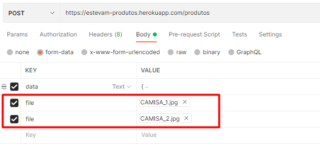

# ecommerce-produtos
Microsserviço destinado a manipulação dos dados de produtos.

  

## :hammer: Recomendações para Teste da API

  Para efetuar os testes dos serviços pode-se utilizar o Postman. Foi colocado juntamente no repositório o arquivo **"Envixo - Teste API.postman_collection.json"** para importação, com algumas requisições já mapeadas para testes.
  
  Para execução local da aplicação, observar as configurações do database no arquivo de propriedades **"application.properties"**. 
  
  Há também uma instância desta aplicação rodando no Heroku, disponibilizada em https://estevam-produtos.herokuapp.com/
  
  Observar que para o registro de produtos foi utilizado o recurso de multipart/form-data, para envio do JSON com os dados e as imagens em uma mesma requisição. Desta forma, será necessário anexar os arquivos para o teste.

## :hammer: Serviços

- `Categoria`: serviços de manipulação de Categoria de Produtos

    * Registrar Categoria
    
    * Consultar Todas as Categoria
    
    * Consultar Detalhes da Categoria
    
    * Alterar Categoria
    
    * Excluir Categoria
    
- `Produto`: serviços de manipulação de Produtos

    * Registrar Produto
    
    * Pesquisar Produtos
    
    * Consultar Detalhes do Produto
    
    * Excluir Produto
